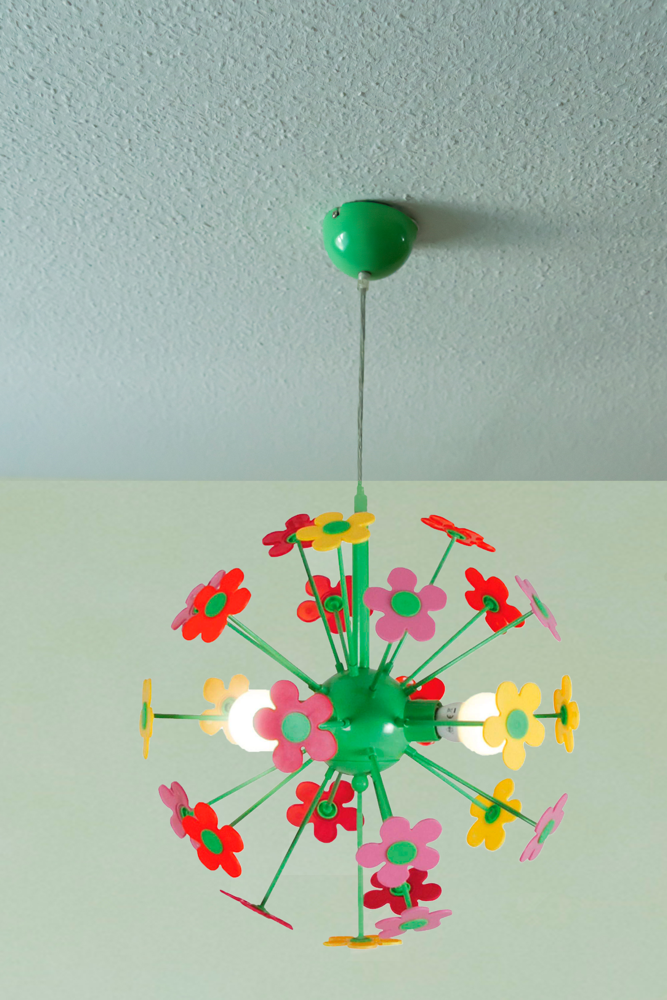
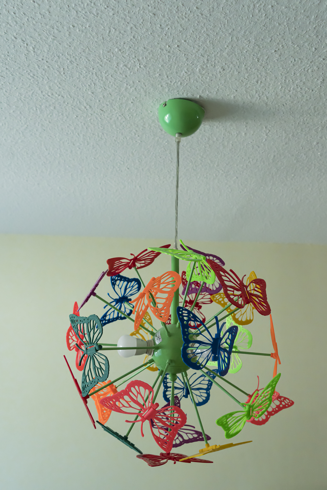
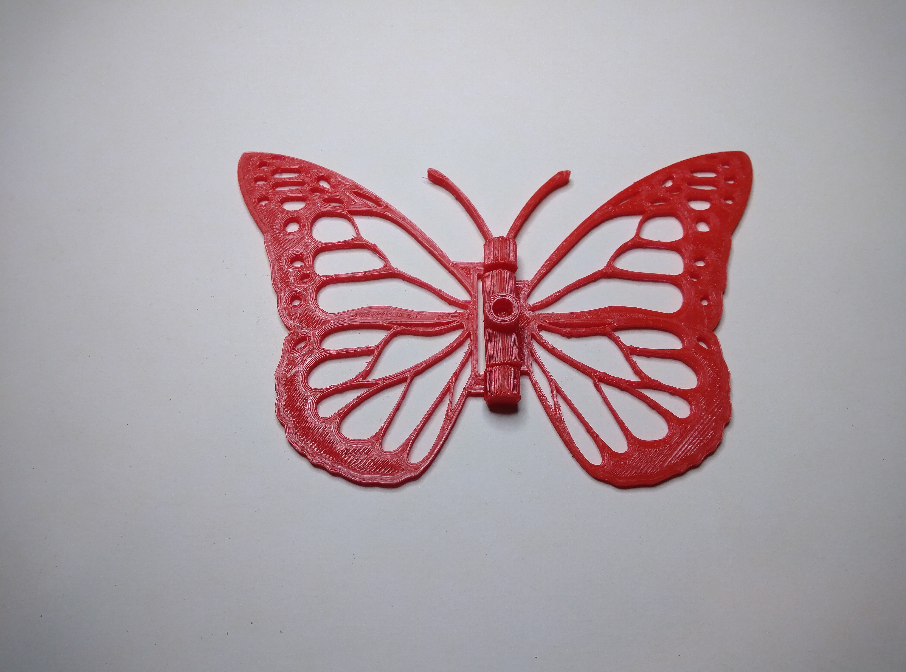
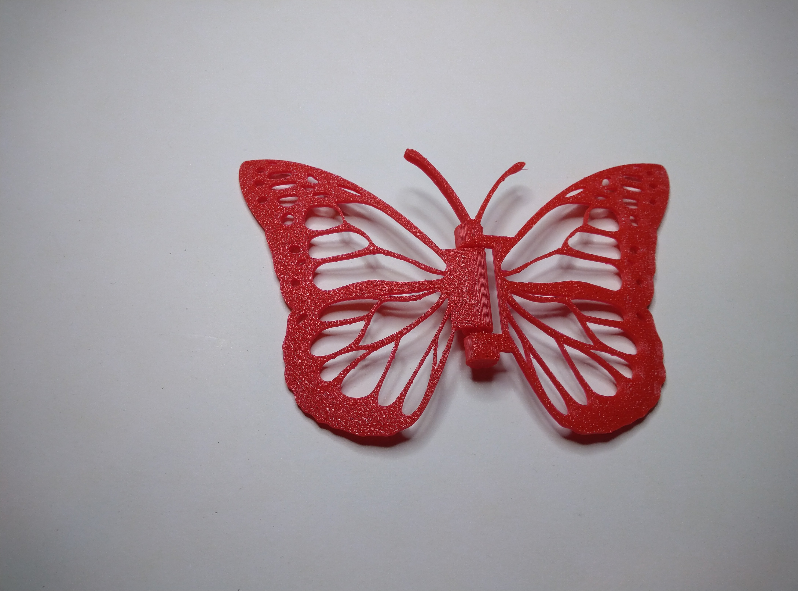
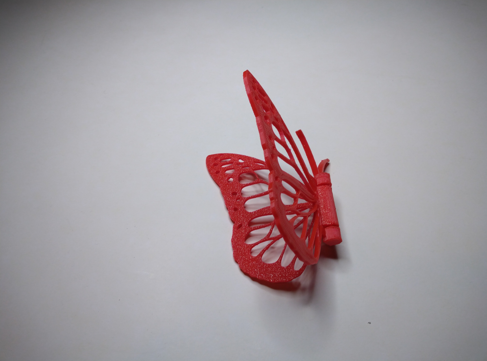
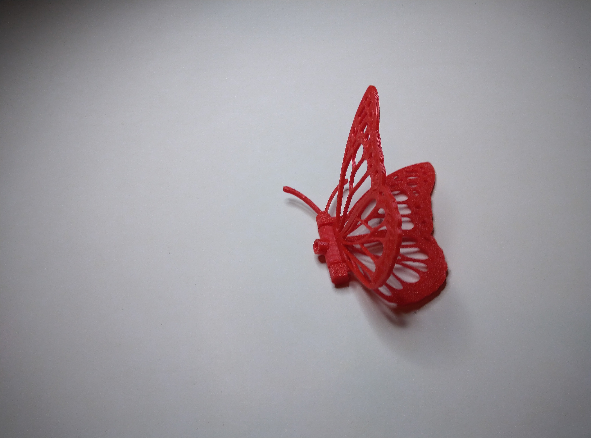
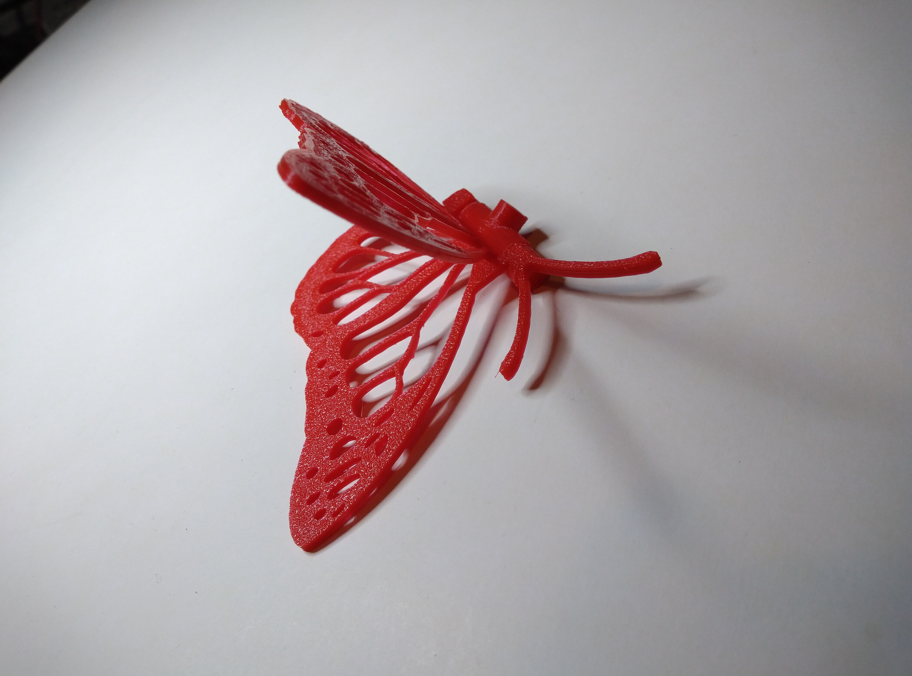

# Näve lamp - butterfly-addon
3D printable additional butterfly pattern for Näve lamp, created with Rhino 6.
The original lamp has a flower on each tip. I replaced this flowers with this Butterflys.
You can print in different colors.

#### 3D Butterfly 
The Butterfly consists of 2 parts who are printed together. 

Requirements:
* 3D printer 
* Filament of your choice

#### View

